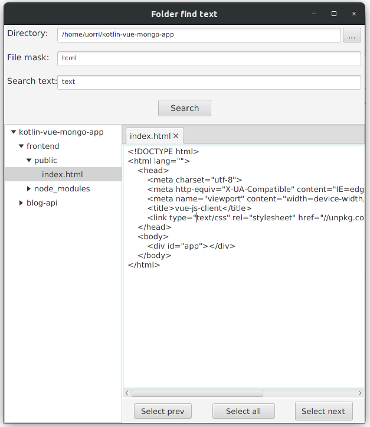

# FolderFindText - JavaFX

 <strong>
 Folder Find Text is designed to quickly recursively search text in folders and just files. 
</strong>

## Getting Started

- To run this Project use **[Main.java](FolderFindText/src/Main.java)**.

## Requirements
* Java +8
